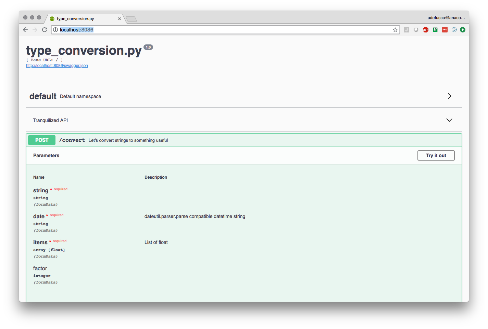

# Tranquilizer

Deploy a REST API with one line by decorating your functions.

## Quick start

In a script file called `cheese_shop.py` the decorated function
will be served as an end point called `cheese` with the GET method. The
function must return a JSON serializable object. Dictionaries are preferable.

See the [complete description of `@tranquilize()`](#tranquilize-decorator) below.

```python
from tranquilizer import tranquilize

@tranquilize()
def order(cheese):
    '''I'd like to buy some cheese!'''
    return {'response':"I'm afraid we're fresh out of {}, Sir.".format(cheese)}
```

The REST API is served by [Flask](http://flask.pocoo.org/) and [Flask-RESTPlus](http://flask-restplus.readthedocs.io/en/stable/index.html)
using the `tranquilizer` command.


```
> tranquilizer cheese_shop.py
 * Serving Flask app "tranquilizer.application" (lazy loading)
 * Environment: production
   WARNING: Do not use the development server in a production environment.
   Use a production WSGI server instead.
 * Debug mode: off
 * Running on http://0.0.0.0:8086/ (Press CTRL+C to quit)

```

Let's see if there is any Red Leicester.

```
> curl -G http://localhost:8086/order --data-urlencode "cheese=Red Leicester"
{"response":"I'm afraid we're fresh out of Red Leicester, Sir."}
```

How about in Python?

```python
In [1]: import requests

In [2]: response = requests.get('http://localhost:8086/order', params={'cheese':'Red Leicester'})

In [3]: response.json()
Out[3]: {'response': "I'm afraid we're fresh out of Red Leicester, Sir."}
```

The *tranquilized* API is documented with [Swagger](https://swagger.io/tools/open-source/) and is accessible
in your web browser at [http://localhost:8086](http://localhost:8086).


## Tranquilize Decorator

The `@tranqulizer` decorator will assign the GET method by default. POST is also supported with `method='post'`.
Other methods are under consideration.

By default a *tranquilized* function will receive all inputs as strings. This behavior can be modified by using [type hints](https://docs.python.org/3/library/typing.html). When data is received by the Flask server it will use the provided
type function to transform the string to the requested data type. This avoids having to perform the conversion in your *tranquilized* function.

## Data Types

In addition to [*builtin* types](https://docs.python.org/3/library/stdtypes.html) Tranquilizer provides several new types in the `tranquilizer.types` module. 

|Type|Description|
|----|-----------|
|`ParsedDateTime`| Converts string to `datetime.datetime` with `dateutil.parser.parse`.|
|`TypedList[<type>]`| Converts *repeated* arguments to a list of type `\<type\>`.|

`TypedList` arguments are constructed using the `action='append'` argument described in
the [Flask RESTPlus documentation](http://flask-restplus.readthedocs.io/en/stable/parsing.html#multiple-values-lists)`.
Any valid type can be used in `TypedList[]`.

The following types are subclasses of `tranquilizer.types.File`, which returns a [werkzeug `FileStorage`](http://werkzeug.pocoo.org/docs/0.14/datastructures/#werkzeug.datastructures.FileStorage).
`FileStorage` is a file-like object that supports methods like `.read()` and `.readlines()`.
These types support sending files with cURL using `-F`.

|Type|Description|
|----|-----------|
|`File`| File-like object to read binary data.|
|`TextFile`| Converts `File` type to `io.StringIO()`.|
|`Image`| Converts `File` type to `PIL.Image`.|
|`NDArray`| Converts `File` type to NumPy array using `np.load()`. |

### Custom types

Custom type classes can be built...

## Type hints example

The example below uses `int`, `ParsedDateTime`, and `TypedList`. `ParsedDataTime`
has been built with `datetutil` and will convert any compatible datetime string to a `datetime.datetime` object. `TypedList`
supports specialization with `[]` and will transform all *repeated* arguments passed to the REST API into a list and convert
the type of each element.

Finally, tranquilizer supports default arguments.

```python
from tranquilizer import tranquilize
from tranquilizer.types import ParsedDateTime, TypedList

@tranquilize(method='post')
def convert(string: str, date: ParsedDateTime, items: TypedList[float], factor: int = 10):
    '''Let's convert strings to something useful'''

    new_items = [i * factor for i in items]

    response = {
            'string': string.upper(),
            'date'  : date.strftime('%c'),
            'items' : new_items
    }

    return response
```

Let's see what happens when I POST to this REST API.

```python
In [1]: data = {'string':'hello, world!', 'date':'4th July 1776', 'items':range(5)}

In [2]: import requests

In [3]: response = requests.post('http://localhost:8086/convert', data=data)

In [4]: response.json()
Out[4]:
{'date': 'Thu Jul  4 00:00:00 1776',
 'items': [0.0, 10.0, 20.0, 30.0, 40.0],
 'string': 'HELLO, WORLD!'}

In [5]:
```

Types defined by tranquilizer will include the description of how the data will be converted.



